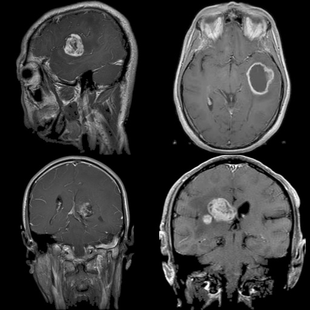
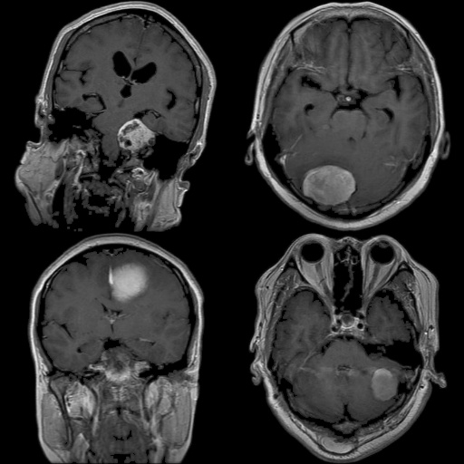
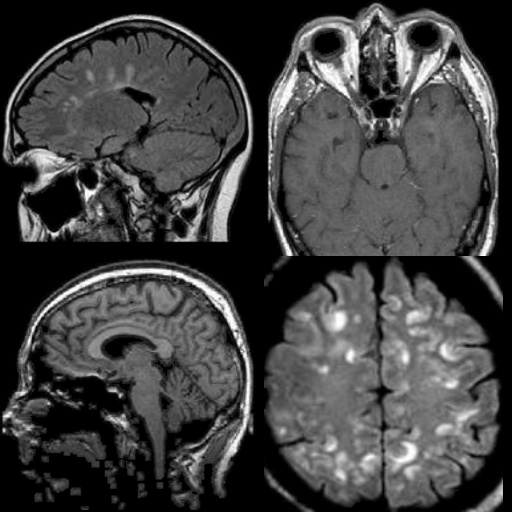
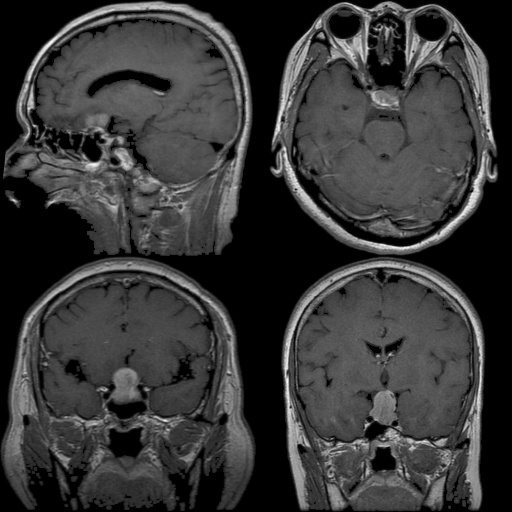

# Project Title

_Brain Tumor Image Classification with Convolutional Neural Network_

---

## Table of Contents

- [Overview](#overview)
- [Dataset](#dataset)
- [Model](#model)
- [Results](#results)
- [Installation](#installation)
- [Usage](#usage)
- [Project Motivation](#project-motivation)
- [Future Work](#future-work)
- [License](#license)

---

## Overview

_This project builds a convolutional neural network model to classify MRI images for types of Brain tumors. This project covers model training, evaluation, and simple visualization._

---

## Dataset

- **Source**: [Brain tumors 256x256 by thomasdubail on Kaggle](https://www.kaggle.com/datasets/thomasdubail/brain-tumors-256x256)
- **Description**:
  - Image dimension: `256x256`
  - Number of classes / labels: `4`
  - Number of samples:
    1. Glioma Tumor = 901 Image
        
    2. Meningioma Tumor = 913 Image
        
    3. Normal = 438 Image
        
    4. Pituitary Tumor = 844 Image
        

---

## Model

- **Type / Architecture**: Custom CNN Model
- **Framework**: Keras
- **Type**: Sequential
- **Layers**:
  | Layer (type)                   | Output Shape          | Param # |
  | ------------------------------ | --------------------- | ------- |
  | conv2d (Conv2D)                | (None, 222, 222, 64)  | 1792    |
  | max_pooling2d (MaxPooling2D)   | (None, 111, 111, 64)  | 0       |
  | conv2d_1 (Conv2D)              | (None, 109, 109, 128) | 73856   |
  | max_pooling2d_1 (MaxPooling2D) | (None, 54, 54, 128)   | 0       |
  | conv2d_2 (Conv2D)              | (None, 52, 52, 256)   | 295168  |
  | max_pooling2d_2 (MaxPooling2D) | (None, 26, 26, 256)   | 0       |
  | conv2d_3 (Conv2D)              | (None, 24, 24, 256)   | 590080  |
  | max_pooling2d_3 (MaxPooling2D) | (None, 12, 12, 256)   | 0       |
  | conv2d_4 (Conv2D)              | (None, 10, 10, 512)   | 1180160 |

---

## Results

- **Metrics**:
  - Accuracy: `85.990`
  - Precision: `87.129`
  - Recall: `85.024`
  - F1-score: `86.694`
- **Visualizations**:
  - Loss & Accuracy Curves:
      

---

## Project Motivation

_This project is made by a team for the purposes of a university course project._

---

## Future Work

_This project could be improved further with more complex models to improve the performance of the model._

---

## License

This project is licensed under the MIT License.

> Note: This project uses a model trained on the Brain tumor 256x256 dataset provided by Kaggle. The dataset is subject to Kaggle’s terms of use and is not redistributed here.